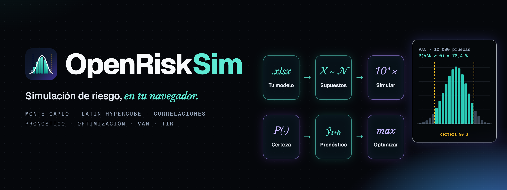
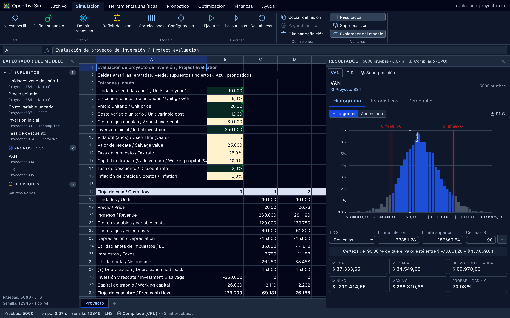
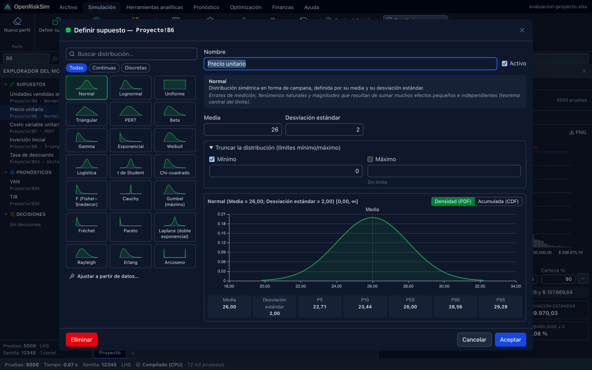
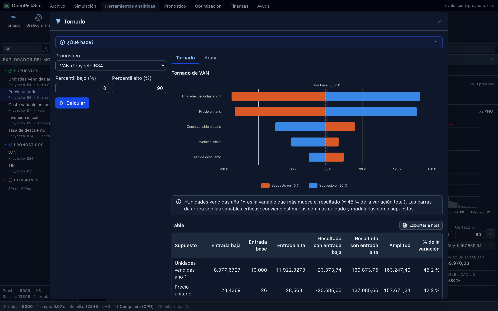
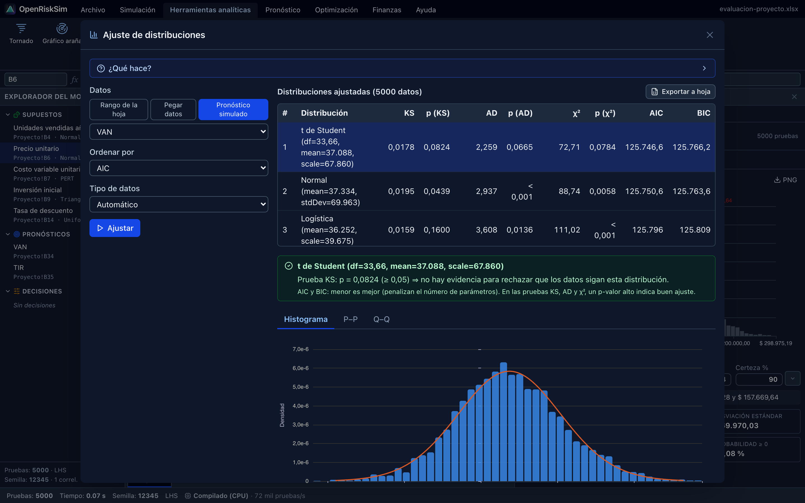
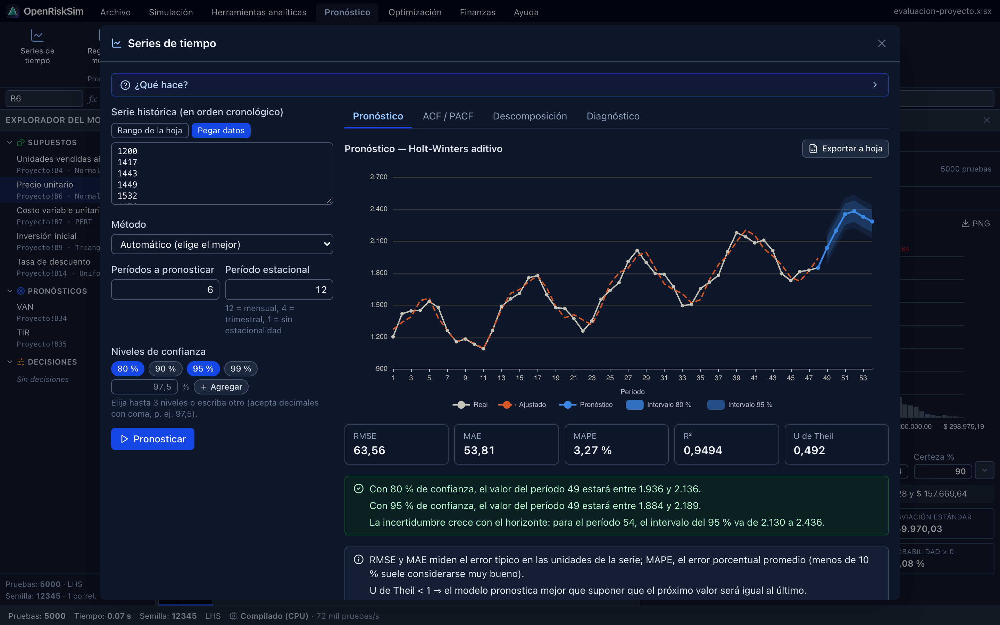
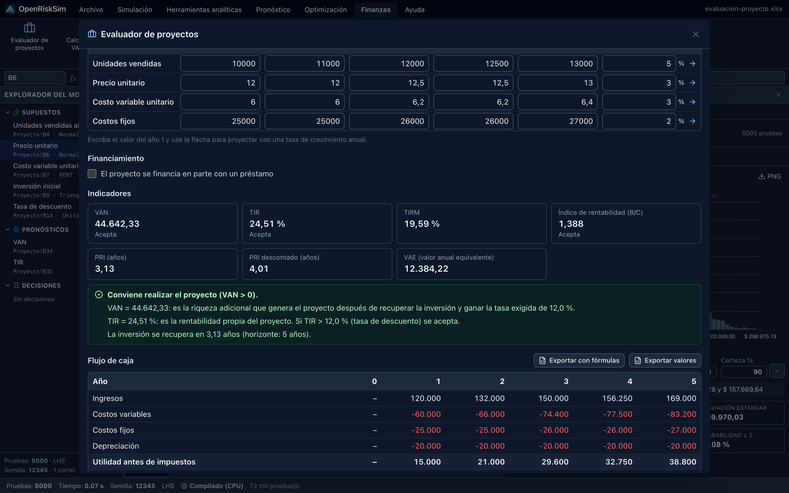
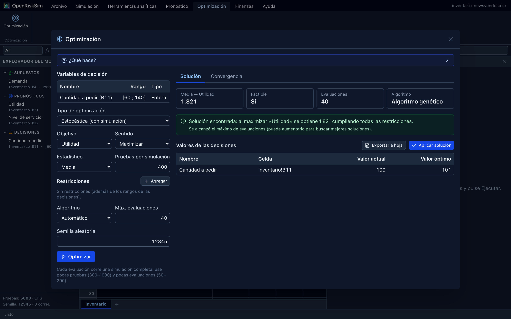
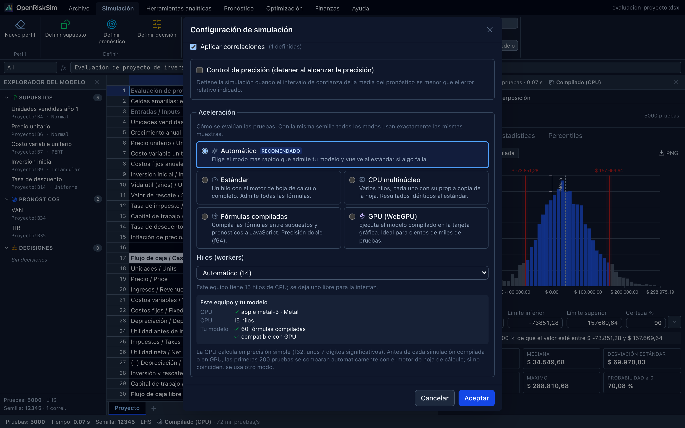

<p align="right"><a href="README.md">English</a> · <b>Español</b></p>

<p align="center">
  
</p>

<p align="center">
  <b>Abre tu modelo de Excel, marca las variables inciertas y ejecuta miles de escenarios.<br>
  OpenRiskSim te muestra la distribución del VAN, la probabilidad de perder dinero y qué variables pesan más —<br>
  una alternativa libre y gratuita a Risk Simulator, @RISK y Crystal Ball que funciona en cualquier computadora.</b>
</p>

<p align="center">
  
  <a href="https://github.com/fernandevdaza/openrisksim/actions/workflows/ci.yml"></a>
  
  
  
  
  <br>
  
  
  
  
  
  <a href="LICENSE"></a>
</p>

<p align="center">
  <a href="https://fernandevdaza.github.io/openrisksim/"><b>🌐 Abrir la app</b></a> ·
  <a href="https://github.com/fernandevdaza/openrisksim/releases"><b>⬇️ Descargar para escritorio</b></a> ·
  <a href="https://fernandevdaza.github.io/openrisksim/docs/"><b>📖 Documentación</b></a> ·
  <a href="https://fernandevdaza.github.io/openrisksim/docs/tutorial/evaluacion-de-proyecto"><b>🎓 Tutorial</b></a> ·
  <a href="#-desarrollo"><b>🛠️ Desarrollo</b></a>
</p>

<div align="center">

| **33 distribuciones** | **Hasta 120 M pruebas/s** | **20 herramientas** | **563 pruebas** | **Cualquier sistema** |
|:---:|:---:|:---:|:---:|:---:|
| continuas y discretas, truncamiento | GPU opcional (WebGPU) y fórmulas compiladas | análisis · pronóstico · optimización · finanzas | contra Excel, R y SciPy | macOS · Linux · Windows · Chromebook |

</div>

> **Tus datos no salen de tu computadora.** Todo — el motor de fórmulas, la simulación, los gráficos — se ejecuta
> localmente en tu navegador. Sin servidor, sin cuentas, sin rastreo. Instálala como app y funciona sin conexión.

---

## ✨ Funcionalidades

- **Trabaja con tu hoja de cálculo.** Abre archivos `.xlsx` de Excel, LibreOffice, WPS o Google Sheets (o `.csv`). Un
  motor de fórmulas compatible con Excel recalcula tu modelo — incluso con funciones en español (`=SUMA`, `=VNA`,
  `=TIR`). El modelo de riesgo se guarda **dentro** del `.xlsx`, así que puedes seguir editándolo en Excel.
- **El mismo flujo de Risk Simulator.** *Definir supuesto*, *Definir pronóstico*, *Ejecutar*, *Paso a paso*,
  *Restablecer*: la misma cinta, las mismas celdas verdes y azules, el mismo gráfico de pronóstico con **certeza de dos
  colas / cola izquierda / cola derecha**.
- **Estadística seria.** 33 distribuciones con truncamiento, muestreo Monte Carlo y **Latin Hypercube**, correlaciones de
  rango (Iman–Conover con reparación de matrices no válidas), semilla reproducible, control de precisión y un panel completo
  de estadísticos (percentiles, asimetría, curtosis, intervalo de confianza de la media…). Miles de pruebas por segundo.
- **Aceleración opcional con GPU.** Tus fórmulas se compilan a código nativo exacto o a un programa **WebGPU** que
  corre en tu tarjeta gráfica (Metal en Mac; Direct3D 12 / Vulkan en NVIDIA, AMD e Intel). También hay modo CPU
  multinúcleo. Cada corrida acelerada se valida automáticamente contra el motor de hoja de cálculo y, si algo no
  coincide, vuelve sola al modo estándar. [Mediciones ↓](#-aceleración)
- **Niveles de confianza configurables.** Elige la banda de certeza y la confianza del intervalo de la media de cada
  pronóstico, y hasta tres niveles de intervalos de predicción en series de tiempo, regresión y procesos estocásticos.
- **Encuentra lo que importa.** Gráficos tornado y araña, sensibilidad (correlación de rangos y contribución a la
  varianza), tablas de escenarios, bootstrap y pruebas de hipótesis.
- **Ajusta distribuciones a tus datos.** Pruebas de Kolmogorov–Smirnov, Anderson–Darling y χ² con p-valores, ranking por
  AIC/BIC y gráficos P–P / Q–Q; luego convierte el mejor ajuste en un supuesto con un clic.
- **Pronósticos.** Promedios móviles, suavizamiento exponencial, Holt, Holt–Winters, ARIMA y auto-ARIMA, tendencias,
  regresión múltiple y por pasos, y procesos estocásticos (movimiento browniano geométrico, reversión a la media, saltos).
- **Optimización con incertidumbre.** Variables de decisión continuas, enteras, binarias y discretas, restricciones,
  optimización estática o **estocástica** (una simulación por candidato), Nelder–Mead, algoritmo genético, recocido
  simulado y frontera eficiente.
- **Caja de herramientas de evaluación de proyectos.** Un evaluador que arma el flujo de caja clásico (del proyecto y del
  inversionista, impuestos con arrastre de pérdidas, capital de trabajo, valor de salvamento, préstamos) y calcula VAN,
  TIR, TIRM, PRI, PRI descontado, índice de rentabilidad y VAE — y lo exporta a una hoja **con fórmulas** lista para
  simular. Además: calculadora VAN/TIR (con detección de TIR múltiples), préstamos, depreciación, WACC/CAPM, punto de
  equilibrio y escenarios.
- **Informes.** Exporta un libro con el informe (estadísticos, percentiles, sensibilidad, imágenes de gráficos) o un PDF.
- **Cómoda de usar.** Interfaz en español e inglés (se detecta sola), tema claro y oscuro, atajos de teclado,
  autoguardado y cinco modelos de ejemplo listos para ejecutar.

## 📸 Capturas

<table>
  <tr>
    <td colspan="2"><p align="center"><sub><b>Simulación</b> · supuestos en verde, pronósticos en azul, distribución del VAN con banda de certeza del 90 %</sub></p></td>
  </tr>
  <tr>
    <td width="50%"><p align="center"><sub><b>Definir supuesto</b> · galería de distribuciones, densidad y percentiles en vivo</sub></p></td>
    <td width="50%"><p align="center"><sub><b>Tornado</b> · qué variables mueven más el VAN</sub></p></td>
  </tr>
  <tr>
    <td><p align="center"><sub><b>Ajuste de distribuciones</b> · KS, Anderson–Darling, χ², AIC/BIC</sub></p></td>
    <td><p align="center"><sub><b>Series de tiempo</b> · selección automática del modelo con intervalos de predicción</sub></p></td>
  </tr>
  <tr>
    <td><p align="center"><sub><b>Evaluador de proyectos</b> · flujo de caja, VAN, TIR, TIRM y PRI con interpretación</sub></p></td>
    <td><p align="center"><sub><b>Optimización</b> · cantidad óptima a pedir con demanda incierta</sub></p></td>
  </tr>
</table>

## ⚡ Aceleración

*Simulación → Configuración → Aceleración* (el modo por defecto, **Automático**, elige el más rápido que admite tu modelo):

| Modo | 100 000 pruebas* | Resultados |
|---|---:|---|
| Estándar (motor de hoja de cálculo) | 4,31 s | referencia |
| CPU multinúcleo (14 workers) | 1,05 s | idénticos |
| Fórmulas compiladas | 0,31 s | idénticos |
| GPU (WebGPU, Metal) | 0,31 s | f32, la media difiere en 2·10⁻⁶ · validados |

<sub>*Ejemplo «Evaluación de proyecto», Apple M5 Pro, Chrome; tiempo total incluyendo muestreo, estadísticos y
sensibilidad. 1 000 000 de pruebas tardan 1,5 s en la GPU y 5 000 000, 8 s. Velocidad de evaluación pura: hoja de
cálculo ≈15 mil pruebas/s, compilado ≈1,5 M/s, GPU 64–120 M/s.</sub>

Los navegadores no pueden usar CUDA ni MPS directamente; **WebGPU** es la capa portable sobre ellos y usa la misma
GPU. Más detalles en la [guía de aceleración](https://fernandevdaza.github.io/openrisksim/docs/guia/aceleracion).

<p align="center"></p>

## 🚀 Empezar en 1 minuto

1. Abre **[la app](https://fernandevdaza.github.io/openrisksim/)** (o instálala: menú del navegador → *Instalar OpenRiskSim*).
2. **Archivo → Ejemplos → Evaluación de proyecto**.
3. **Simulación → Ejecutar**. Lee el histograma: la banda de certeza te dice, por ejemplo, *«hay un 90 % de probabilidad de
   que el VAN esté entre −73.851 y 157.669»*, y los estadísticos muestran **P(VAN ≥ 0)**.
4. Prueba **Herramientas analíticas → Tornado** para ver qué supuesto mueve más el resultado.

Después abre tu propio `.xlsx`, selecciona una celda de entrada y pulsa **Definir supuesto**. La
**[documentación](https://fernandevdaza.github.io/openrisksim/docs/)** recorre paso a paso un trabajo completo de
evaluación de proyectos, como los de clase.

## ⬇️ App de escritorio

¿Prefieres una app normal? Los instaladores para **macOS, Windows y Linux** están en
**[Releases](https://github.com/fernandevdaza/openrisksim/releases)**:

| Sistema | Archivo |
|---|---|
| macOS (Apple Silicon / Intel) | `OpenRiskSim-x.y.z-mac-arm64.dmg` · `OpenRiskSim-x.y.z-mac-x64.dmg` |
| Windows (x64 / ARM64) | `OpenRiskSim-x.y.z-win-x64-setup.exe` · `…-win-arm64-setup.exe` |
| Linux (x64 / ARM64) | `OpenRiskSim-x.y.z-linux-x86_64.AppImage` · `…-linux-amd64.deb` (y ARM64) |

> [!NOTE]
> Las apps todavía no están firmadas. **macOS:** la primera vez, clic derecho sobre la app → *Abrir*
> (o ejecuta `xattr -cr /Applications/OpenRiskSim.app`). **Windows:** si aparece SmartScreen, pulsa *Más información* → *Ejecutar de todas formas*.

Es la misma app que la versión web (mismos archivos, mismos resultados) y funciona sin conexión. Cada push también
compila los instaladores en GitHub Actions ([workflow Desktop apps](https://github.com/fernandevdaza/openrisksim/actions/workflows/desktop.yml) → *Artifacts*).

## 🔁 ¿Vienes de Risk Simulator?

| Risk Simulator | OpenRiskSim |
|---|---|
| Nuevo perfil de simulación | Simulación → Nuevo perfil |
| Establecer supuesto de entrada | Simulación → Definir supuesto (o clic derecho en la celda) |
| Establecer pronóstico de salida | Simulación → Definir pronóstico |
| Ejecutar / Paso a paso / Restablecer | Simulación → Ejecutar / Paso a paso / Restablecer |
| Gráfico de pronóstico (certeza) | Panel de resultados → Histograma |
| Tornado, Sensibilidad, Escenarios | Herramientas analíticas |
| Ajuste de distribuciones | Herramientas analíticas → Ajuste de distribuciones |
| Pronóstico (series de tiempo, ARIMA, regresión, procesos estocásticos) | Pronóstico |
| Optimización | Optimización |

La tabla completa — y lo que todavía falta — está en la
[documentación](https://fernandevdaza.github.io/openrisksim/docs/referencia/risk-simulator).

## ✅ Verificación

Lo primero es que los números sean correctos. Los paquetes numéricos se prueban contra valores de referencia de
**Excel, R y SciPy**:

```bash
pnpm test
```

| Paquete | Qué verifica |
|---|---|
| `distributions` | densidad, acumulada y cuantiles de las 33 familias contra SciPy (≈1e-11), colas hasta 1e-12, momentos con 200 mil muestras, el ajuste recupera parámetros conocidos |
| `engine` | estratos del Latin Hypercube, Iman–Conover alcanza la correlación pedida sin alterar las marginales, estadísticos contra Excel (`DESVEST.M`, `COEFICIENTE.ASIMETRIA`, `CURTOSIS`, `PERCENTIL.INC`) |
| `finance` | `PAGO`, `VNA`, `TIR`, `TIRM`, `VNA.NO.PER`, `TIR.NO.PER`, `DVS`… contra Excel; identidades del flujo de caja, saldos de préstamos |
| `forecast` | ejemplo de `ESTIMACION.LINEAL`, estacionalidad de Holt–Winters, recuperación de parámetros ARIMA, p-valores de MacKinnon |
| `optimizer` | Rosenbrock, Himmelblau, mochila 0-1, problemas con restricciones e igualdades, frontera eficiente |
| `workbook` | ida y vuelta xlsx, CSV en español, motor de fórmulas, modelos de ejemplo sin errores de fórmula |

Los libros de ejemplo también se abrieron en Microsoft Excel para Mac sin ningún error de fórmula.

## 🛠️ Desarrollo

Requisitos: [Node.js](https://nodejs.org) 20+ y [pnpm](https://pnpm.io) (`corepack enable`).

```bash
pnpm install
pnpm dev            # app web en http://localhost:5173
pnpm test           # 563 pruebas unitarias (Vitest)
pnpm typecheck
pnpm docs:dev       # sitio de documentación
pnpm screenshots    # regenera íconos, banners y capturas (necesita Google Chrome)
```

```
packages/
  core/           tipos compartidos (los contratos entre paquetes)
  distributions/  generador aleatorio, funciones especiales, 33 distribuciones, ajuste de distribuciones
  engine/         muestreo (MC / LHS), correlaciones, estadísticos, ejecución de la simulación, sensibilidad
  finance/        VAN, TIR, TIRM, PRI, flujo de caja del proyecto, préstamos, depreciación…
  forecast/       suavizamiento, ARIMA, regresión, procesos estocásticos
  optimizer/      Nelder–Mead, algoritmo genético, recocido simulado, optimización estocástica
  workbook/       lectura/escritura xlsx y csv, motor HyperFormula, evaluador del modelo, Web Worker, informes, ejemplos
apps/web/         interfaz en React 19 + Vite + Tailwind + ECharts
docs/             documentación en VitePress (español e inglés)
scripts/          generación de imágenes (íconos, banners, capturas)
```

Arquitectura y contratos entre paquetes: **[documentación para desarrolladores](https://fernandevdaza.github.io/openrisksim/docs/desarrolladores/arquitectura)**.
Cada push a `main` publica la app y la documentación en GitHub Pages.

## 🤝 Contribuir

Las contribuciones son bienvenidas: reportes de errores con un `.xlsx` de ejemplo, nuevas distribuciones o herramientas,
traducciones y documentación. Issues y pull requests en español o inglés. Lee
[CONTRIBUTING.es.md](CONTRIBUTING.es.md) y el [Código de conducta](CODE_OF_CONDUCT.md).

## 📄 Licencia

[GPL-3.0-or-later](LICENSE) © 2026 Fernando Daza y colaboradores.

Hecho con [React](https://react.dev), [TypeScript](https://www.typescriptlang.org), [Vite](https://vite.dev),
[HyperFormula](https://hyperformula.handsontable.com) (GPLv3), [ExcelJS](https://github.com/exceljs/exceljs),
[Apache ECharts](https://echarts.apache.org), [Tailwind CSS](https://tailwindcss.com) y
[VitePress](https://vitepress.dev).

<sub>Risk Simulator, @RISK y Crystal Ball son marcas registradas de sus respectivos dueños. OpenRiskSim es un proyecto
independiente y no está afiliado a ellos.</sub>
