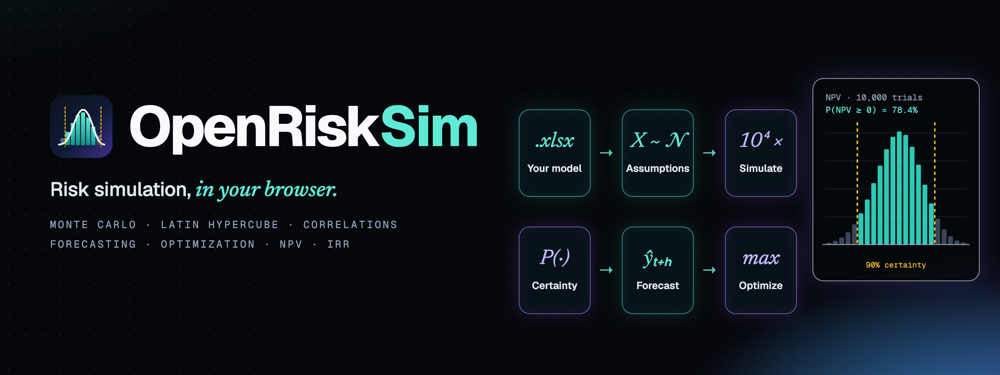
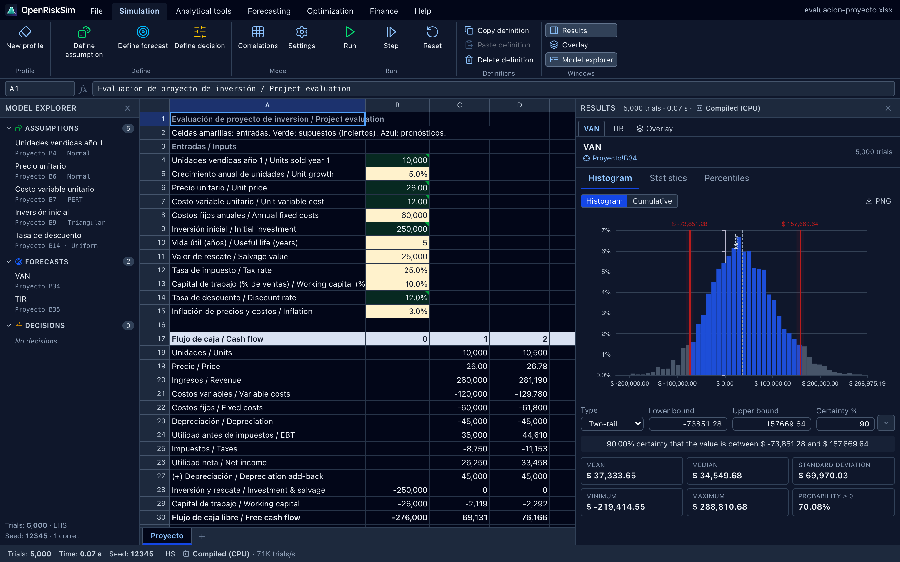
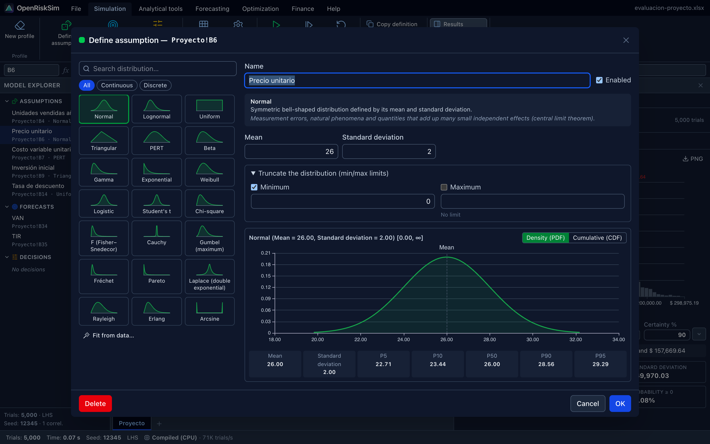
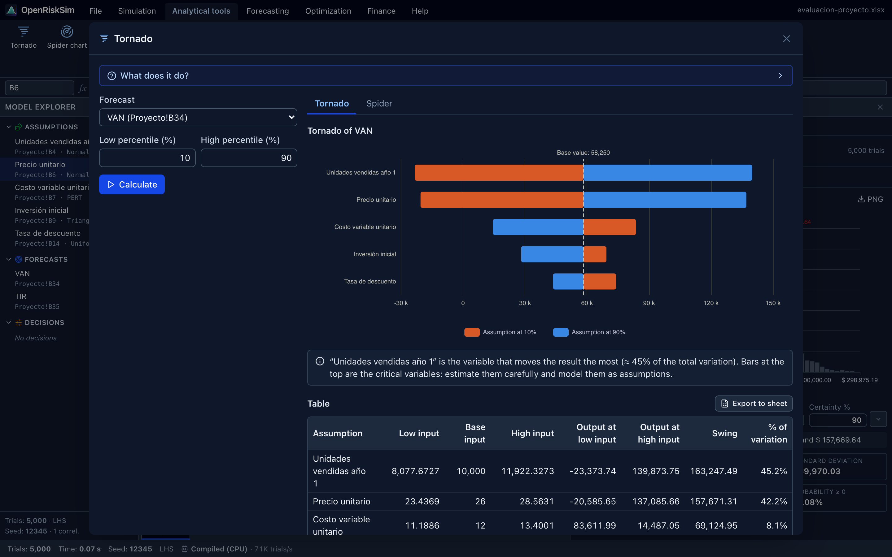
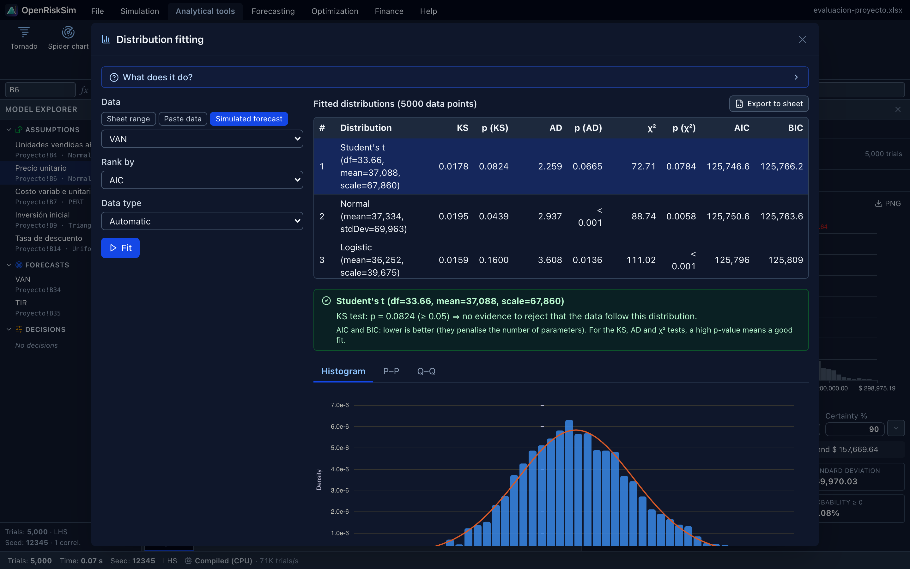
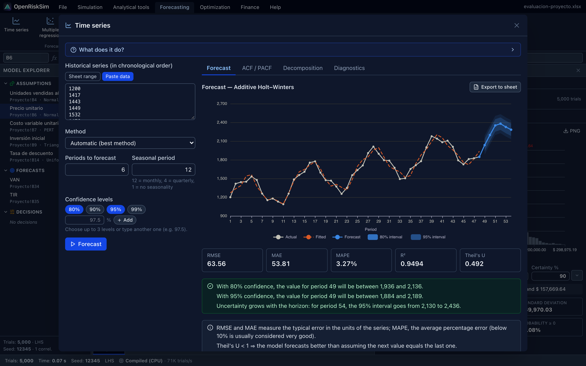
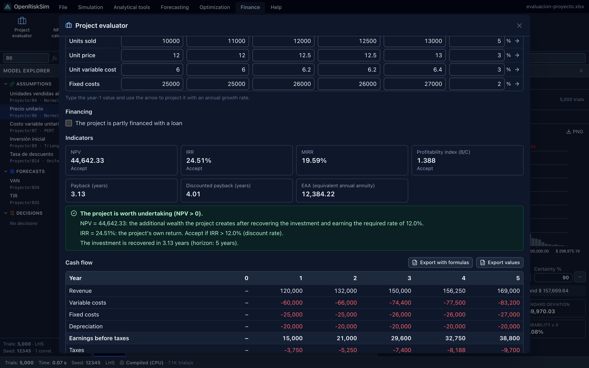
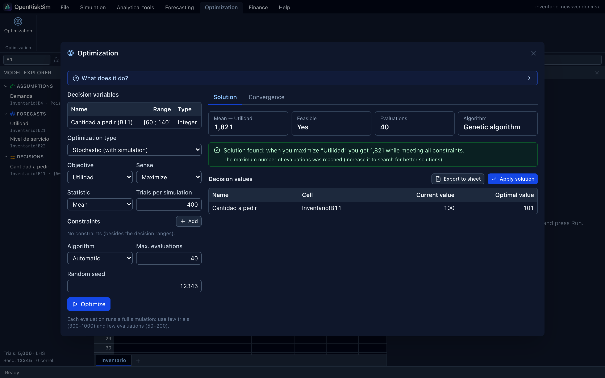
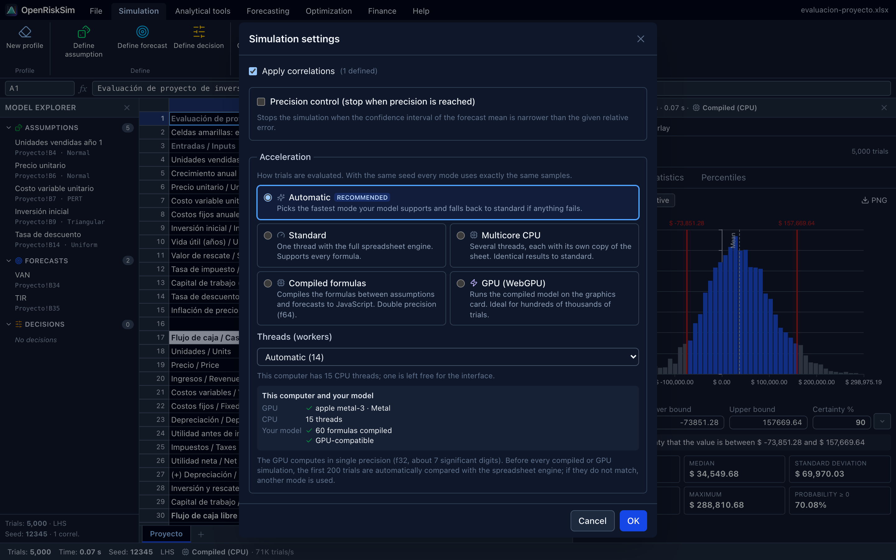

<p align="right"><b>English</b> · <a href="README.es.md">Español</a></p>

<p align="center">
  
</p>

<p align="center">
  <b>Open your Excel model, mark the uncertain inputs, and run thousands of scenarios.<br>
  OpenRiskSim shows the distribution of your NPV, the probability of losing money and which variables matter most —<br>
  a free, open-source alternative to Risk Simulator, @RISK and Crystal Ball that runs on any computer.</b>
</p>

<p align="center">
  
  <a href="https://github.com/fernandevdaza/openrisksim/actions/workflows/ci.yml"></a>
  
  
  
  
  <br>
  
  
  
  
  
  <a href="LICENSE"></a>
</p>

<p align="center">
  <a href="https://fernandevdaza.github.io/openrisksim/"><b>🌐 Open the app</b></a> ·
  <a href="https://github.com/fernandevdaza/openrisksim/releases"><b>⬇️ Download for desktop</b></a> ·
  <a href="https://fernandevdaza.github.io/openrisksim/docs/en/"><b>📖 Documentation</b></a> ·
  <a href="https://fernandevdaza.github.io/openrisksim/docs/en/tutorial/project-evaluation"><b>🎓 Tutorial</b></a> ·
  <a href="#-development"><b>🛠️ Develop</b></a>
</p>

<div align="center">

| **33 distributions** | **Up to 120 M trials/s** | **20 tools** | **563 tests** | **Any OS** |
|:---:|:---:|:---:|:---:|:---:|
| continuous and discrete, truncation | optional GPU (WebGPU) and compiled formulas | analysis · forecasting · optimization · finance | against Excel, R and SciPy | macOS · Linux · Windows · Chromebook |

</div>

> **Your data never leaves your computer.** Everything — the formula engine, the simulation, the charts — runs locally in
> your browser. No server, no account, no tracking. Install it as an app and it works offline.

---

## ✨ Features

- **Works with your spreadsheet.** Open `.xlsx` files from Excel, LibreOffice, WPS or Google Sheets (or `.csv`). An
  Excel-compatible formula engine recalculates your model — including Spanish function names (`=SUMA`, `=VNA`, `=TIR`).
  The risk model is saved **inside** the `.xlsx`, so you can keep editing it in Excel.
- **Risk Simulator workflow, nothing new to learn.** *Define assumption*, *Define forecast*, *Run*, *Step*, *Reset* — the
  same ribbon, the same green/blue cells, the same forecast chart with **two-tail / left-tail / right-tail certainty**.
- **Serious statistics.** 33 distributions with truncation, Monte Carlo and **Latin Hypercube** sampling, rank correlations
  (Iman–Conover with nearest-correlation repair), reproducible seeds, precision control, and a full statistics panel
  (percentiles, skewness, kurtosis, confidence interval of the mean…). Thousands of trials per second in a Web Worker.
- **Optional GPU acceleration.** Your formulas are compiled into exact native code or into a **WebGPU** compute
  shader that runs on your graphics card (Metal on Macs, Direct3D 12 / Vulkan on NVIDIA, AMD and Intel). Also
  multi-core CPU mode. Every fast run is automatically validated against the spreadsheet engine and falls back on its
  own if anything doesn't match. [Benchmarks ↓](#-acceleration)
- **Configurable confidence levels.** Choose the certainty band and the confidence of the mean for each forecast,
  and up to three prediction-interval levels in time series, regression and stochastic processes.
- **Find what matters.** Tornado and spider charts, sensitivity (rank correlation and contribution to variance),
  scenario tables, bootstrap and hypothesis tests.
- **Fit distributions to data.** Kolmogorov–Smirnov, Anderson–Darling and χ² tests with p-values, AIC/BIC ranking,
  P–P / Q–Q plots — then turn the best fit into an assumption with one click.
- **Forecasting.** Moving averages, exponential smoothing, Holt, Holt–Winters, ARIMA and auto-ARIMA, trend models,
  multiple and stepwise regression, and stochastic processes (GBM, mean reversion, jump diffusion).
- **Optimization under uncertainty.** Continuous, integer, binary and discrete decision variables, constraints,
  static or **stochastic** optimization (a simulation per candidate), Nelder–Mead, genetic algorithm, simulated annealing
  and efficient frontiers.
- **Project finance toolkit.** A project evaluator that builds the classic cash-flow statement (project and equity cash
  flows, taxes with loss carry-forward, working capital, salvage value, loans) and computes NPV, IRR, MIRR, payback,
  discounted payback, profitability index and EAA — and exports it to a sheet **with live formulas** ready to simulate.
  Plus NPV/IRR (with multiple-IRR detection), loan schedules, depreciation, WACC/CAPM, break-even and scenarios.
- **Reports.** Export a report workbook (statistics, percentiles, sensitivity, chart images) or a printable PDF.
- **Pleasant to use.** English/Spanish interface (auto-detected), light and dark themes, keyboard shortcuts, autosave,
  and five ready-to-run example models.

## 📸 Screenshots

<table>
  <tr>
    <td colspan="2"><p align="center"><sub><b>Simulation</b> · assumptions in green, forecasts in blue, NPV distribution with 90% certainty band</sub></p></td>
  </tr>
  <tr>
    <td width="50%"><p align="center"><sub><b>Define assumption</b> · distribution gallery, live PDF/CDF and percentiles</sub></p></td>
    <td width="50%"><p align="center"><sub><b>Tornado</b> · which variables move the NPV the most</sub></p></td>
  </tr>
  <tr>
    <td><p align="center"><sub><b>Distribution fitting</b> · KS, Anderson–Darling, χ², AIC/BIC</sub></p></td>
    <td><p align="center"><sub><b>Time series</b> · automatic model selection with prediction intervals</sub></p></td>
  </tr>
  <tr>
    <td><p align="center"><sub><b>Project evaluator</b> · cash flow, NPV, IRR, MIRR, payback with interpretation</sub></p></td>
    <td><p align="center"><sub><b>Stochastic optimization</b> · best order quantity under uncertain demand</sub></p></td>
  </tr>
</table>

## ⚡ Acceleration

*Simulation → Settings → Acceleration* (the default, **Auto**, picks the fastest mode your model supports):

| Mode | 100,000 trials* | Results |
|---|---:|---|
| Standard (spreadsheet engine) | 4.31 s | reference |
| Multi-core CPU (14 workers) | 1.05 s | identical |
| Compiled formulas | 0.31 s | identical |
| GPU (WebGPU, Metal) | 0.31 s | f32, mean differs by 2·10⁻⁶ · validated |

<sub>*Project-evaluation example, Apple M5 Pro, Chrome; wall-clock time including sampling, statistics and sensitivity.
1,000,000 trials take 1.5 s on the GPU and 5,000,000 take 8 s. Raw evaluation throughput: spreadsheet ≈15k trials/s,
compiled ≈1.5M/s, GPU 64–120M/s.</sub>

Browsers cannot call CUDA or MPS directly; **WebGPU** is the portable layer on top of them and uses the same GPU.
See the [acceleration guide](https://fernandevdaza.github.io/openrisksim/docs/en/guide/acceleration).

<p align="center"></p>

## 🚀 Quick start

1. Open **[the app](https://fernandevdaza.github.io/openrisksim/)** (or install it: browser menu → *Install OpenRiskSim*).
2. **File → Examples → Project evaluation**.
3. **Simulation → Run**. Read the histogram: the certainty band tells you, for example, *"there is a 90% chance that the
   NPV is between −73,851 and 157,669"*, and the statistics show **P(NPV ≥ 0)**.
4. Try **Analytical tools → Tornado** to see which assumption drives the result.

Then open your own `.xlsx`, select an input cell and click **Define assumption**. The
**[documentation](https://fernandevdaza.github.io/openrisksim/docs/en/)** walks through a full project-evaluation
assignment step by step.

## ⬇️ Desktop app

Prefer a regular app? Installers for **macOS, Windows and Linux** are on the
**[Releases](https://github.com/fernandevdaza/openrisksim/releases)** page:

| System | File |
|---|---|
| macOS (Apple Silicon / Intel) | `OpenRiskSim-x.y.z-mac-arm64.dmg` · `OpenRiskSim-x.y.z-mac-x64.dmg` |
| Windows (x64 / ARM64) | `OpenRiskSim-x.y.z-win-x64-setup.exe` · `…-win-arm64-setup.exe` |
| Linux (x64 / ARM64) | `OpenRiskSim-x.y.z-linux-x86_64.AppImage` · `…-linux-amd64.deb` (and ARM64) |

> [!NOTE]
> The apps are not code-signed yet. **macOS:** the first time, right-click the app → *Open*
> (or run `xattr -cr /Applications/OpenRiskSim.app`). **Windows:** if SmartScreen appears, click *More info* → *Run anyway*.

It is the same app as the web version (same files, same results) and works fully offline. Every push also builds
the installers in GitHub Actions ([Desktop apps workflow](https://github.com/fernandevdaza/openrisksim/actions/workflows/desktop.yml) → *Artifacts*).

## 🔁 Coming from Risk Simulator?

| Risk Simulator | OpenRiskSim |
|---|---|
| New Simulation Profile | Simulation → New profile |
| Set Input Assumption | Simulation → Define assumption (or right-click a cell) |
| Set Output Forecast | Simulation → Define forecast |
| Run / Step / Reset Simulation | Simulation → Run / Step / Reset |
| Forecast chart (certainty) | Results panel → Histogram |
| Tornado, Sensitivity, Scenario Analysis | Analytical tools |
| Distributional Fitting | Analytical tools → Distribution fitting |
| Forecasting (time series, ARIMA, regression, stochastic processes) | Forecasting |
| Optimization | Optimization |

The full equivalence table — and what is not implemented yet — is in the
[docs](https://fernandevdaza.github.io/openrisksim/docs/en/reference/risk-simulator).

## ✅ Verification

Correctness comes first. The numerical packages are tested against reference values from **Excel, R and SciPy**:

```bash
pnpm test
```

| Package | What it checks |
|---|---|
| `distributions` | pdf/cdf/quantile of all 33 families vs SciPy (≈1e-11), tails to 1e-12, moments of 200k samples, fitting recovers known parameters |
| `engine` | Latin Hypercube strata, Iman–Conover hits the target rank correlation while preserving marginals, statistics vs Excel (`STDEV.S`, `SKEW`, `KURT`, `PERCENTILE.INC`) |
| `finance` | `PMT`, `NPV`, `IRR`, `MIRR`, `XNPV`, `XIRR`, `VDB`… vs Excel; cash-flow identities, loan balances |
| `forecast` | `LINEST` example, Holt–Winters seasonality, ARIMA parameter recovery, MacKinnon p-values |
| `optimizer` | Rosenbrock, Himmelblau, 0-1 knapsack, constrained and equality problems, efficient frontier |
| `workbook` | xlsx round-trip, Spanish CSV, formula engine, example models with zero formula errors |

The example workbooks were also opened in Microsoft Excel for Mac with zero formula errors.

## 🛠️ Development

Requirements: [Node.js](https://nodejs.org) 20+ and [pnpm](https://pnpm.io) (`corepack enable`).

```bash
pnpm install
pnpm dev            # web app at http://localhost:5173
pnpm test           # 563 unit tests (Vitest)
pnpm typecheck
pnpm docs:dev       # documentation site
pnpm screenshots    # regenerate icons, banners and screenshots (needs Google Chrome)
```

```
packages/
  core/           shared types (the contracts between packages)
  distributions/  RNG, special functions, 33 distributions, distribution fitting
  engine/         sampling (MC / LHS), correlations, statistics, simulation runner, sensitivity
  finance/        NPV, IRR, MIRR, payback, project cash flow, loans, depreciation…
  forecast/       smoothing, ARIMA, regression, stochastic processes
  optimizer/      Nelder–Mead, genetic algorithm, simulated annealing, stochastic optimization
  workbook/       xlsx/csv I/O, HyperFormula engine, model evaluator, Web Worker, reports, examples
apps/web/         React 19 + Vite + Tailwind + ECharts user interface
docs/             VitePress documentation (Spanish and English)
scripts/          image generation (icons, banners, screenshots)
```

Architecture and package contracts: **[developer docs](https://fernandevdaza.github.io/openrisksim/docs/en/developers/architecture)**.
Pushing to `main` deploys the app and the docs to GitHub Pages.

## 🤝 Contributing

Contributions are welcome — bug reports with an example `.xlsx`, new distributions or tools, translations and docs.
Issues and pull requests in Spanish or English. See [CONTRIBUTING.md](CONTRIBUTING.md) and the
[Code of Conduct](CODE_OF_CONDUCT.md).

## 📄 License

[GPL-3.0-or-later](LICENSE) © 2026 Fernando Daza and contributors.

Built with [React](https://react.dev), [TypeScript](https://www.typescriptlang.org), [Vite](https://vite.dev),
[HyperFormula](https://hyperformula.handsontable.com) (GPLv3), [ExcelJS](https://github.com/exceljs/exceljs),
[Apache ECharts](https://echarts.apache.org), [Tailwind CSS](https://tailwindcss.com) and
[VitePress](https://vitepress.dev).

<sub>Risk Simulator, @RISK and Crystal Ball are trademarks of their respective owners. OpenRiskSim is an independent
project and is not affiliated with them.</sub>
